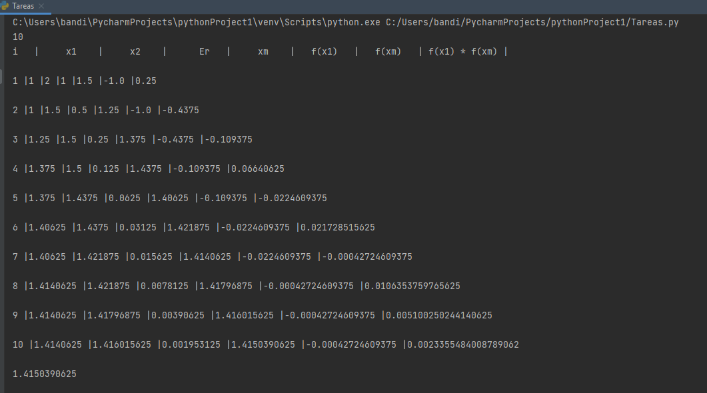
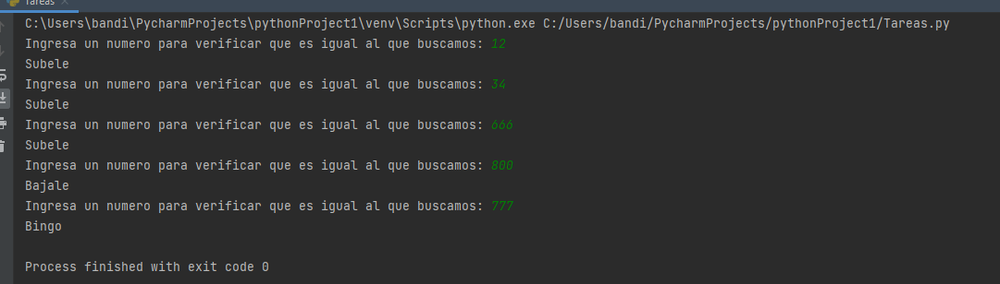
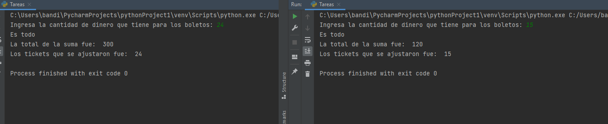
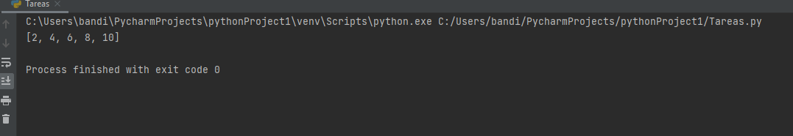
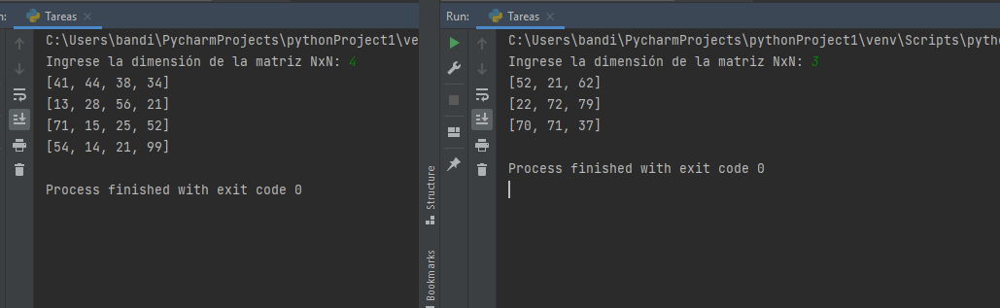
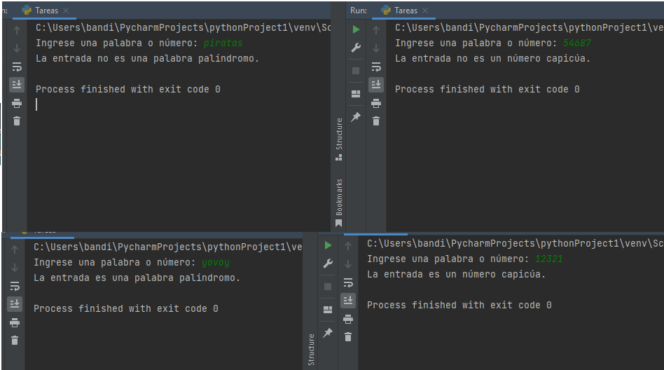

# Exercise 1 Bisection
* The exercise consists of passing the program previously made in c++ to python.
--------------
'''
import math

def fnEcuacion(valor):
    return (math.pow(valor, 2))-2

x1 = 1
x2 = 2

Es = 0.001
Er = abs(x2-x1)
i = 1
it = round((math.log(x2-x1)-math.log(Es))/math.log(2))
print(it)

print("i   |     x1    |     x2    |      Er   |     xm    |"
           "   f(x1)   |   f(xm)   | f(x1) * f(xm) |\n")

while Er >= Es:
    xm = (x1 + x2) / 2
    print("{} |{} |{} |{} |{} |{} |{} \n".format(i, x1, x2, Er, xm,  fnEcuacion(x1), fnEcuacion(xm)))
    if (fnEcuacion(x1) * fnEcuacion(xm)) < 0:
        x2 = xm
    else:
        x1 = xm
    Er = abs(x2-x1)
    i = i + 1

print(xm)
'''

# Exercise 2 Secret number
* The exercise consists of guessing the secret number.
--------------
'''
import array
import os
import time
import math
#secret_number = int(input("Ingresa el numero secreto: "))
secret_number=777
while True:
    num = int(input("Ingresa un numero para verificar que es igual al que buscamos: "))
    if num==secret_number:
        print("Bingo")
        break;
    elif num<secret_number:
        print("Subele")
    elif num>secret_number:
        print("Bajale")
'''

# Exercise 3 Ticket
* The exercise consists of asking for an amount of money and printing how many tickets you have enough, but each time you buy a ticket its price increases (summation).
--------------
'''
import array
import os
import time
import math
ticket = int(input("Ingresa la cantidad de dinero que tiene para los boletos: "))
suma=0
c=0
while True:
    c+=1
    if ticket>=c:
        suma=suma+c
    elif ticket<c:
        print("Es todo")
        break
print("La total de la suma fue: ",suma)
print("Los tickets que se ajustaron fue: ",c-1)
'''

# Exercise 4 Bubbel sort
* The exercise consists of performing the bubble method.
--------------
'''
# Metodo de burbuja 

lista= [8,10,6,2,4]
swapped = True

while swapped:
    swapped = False
    for i in range (len(lista) -1):
        if lista[i] > lista[i+1]:
            swapped=True
            lista[i], lista[i+1] = lista[i+1], lista[i]

print(lista)
'''

# Exercise 5 Palindrome
* The exercise consists of entering a word and printing whether it is a palindrome or not (it reads the same in the normal way and upside down). 
--------------
'''
import random

def llenar_matriz(n):
  matriz = []
  for i in range(n):
    fila = []
    for j in range(n):
      fila.append(random.randint(1, 100))
    matriz.append(fila)
  return matriz

def main():
  n = int(input("Ingrese la dimensión de la matriz NxN: "))
  matriz = llenar_matriz(n)
  for fila in matriz:
    print(fila)

if __name__ == "__main__":
  main()
'''

# Exercise 6 Random Matrix
* The exercise consists of constructing an NxN matrix with random numbers without repeating.
--------------
'''
import random
def es_palindromo(entrada):
  entrada = entrada.replace(" ", "")
  entrada_reversa = entrada[::-1]
  if entrada == entrada_reversa:
    return True
  else:
    return False

entrada = input("Ingrese una palabra o número: ")

if entrada.isdigit():
  resultado = es_palindromo(entrada)
  if resultado:
    print("La entrada es un número capicúa.")
  else:
    print("La entrada no es un número capicúa.")
else:
  resultado = es_palindromo(entrada)
  if resultado:
    print("La entrada es una palabra palíndromo.")
  else:
    print("La entrada no es una palabra palíndromo.")
'''

